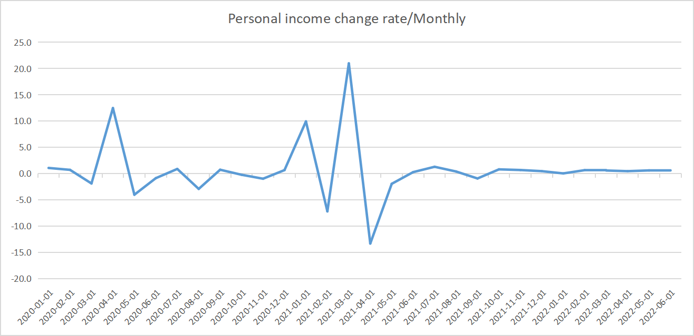

# The impact of lifestyles across the U.S. under hyperinflation

##By Zixuan Pan

## Story Pitch Summary
The United States is facing the most severe inflation in 40 years due to multiple factors, such as the implementation of massive stimulus measures, rebounding demand, and poor supply chain after the outbreak of the new crown epidemic. Different income groups in the United States face a mismatch between income growth and consumption growth simultaneously, forcing many people to change their lifestyles.

This data analysis report will reveal how people's lives are affected by analyzing consumer index breakdowns and income growth levels. By exploring different data, we will demonstrate how people's life patterns have been impacted since the Covid-19 pandemic.

A recent joint survey by George Mason University's School of Policy and Government and The Washington Post revealed that nearly 90 percent of respondents have begun purchasing cheaper goods, and about three-quarters have reduced spending on dining out and entertainment or postponed scheduled purchases.

The survey conducted by CBS News polling shows that rising prices are making many Americans worry about economic turn to negative expectations and being unable to afford their retirement, vacations, and even daily expenses. One-third of the respondents said they were "very concerned" about their ability to pay for goods and services to meet their basic needs.

## Sourcing

In this project, I analyzed CPI data and core CPI data from [U.S. BUREAU OF LABOR STATISTICS](https://www.bls.gov/charts/consumer-price-index/consumer-price-index-by-category.htm),and also compared with the [personal income growth rate from Federal Reserve](https://fred.stlouisfed.org/series/PI). Also with changes in [personal consumption expenditures](https://fred.stlouisfed.org/series/PCE) as an important reference factor, the period of these data all from 2020.Jan to 2022.June.

### Potential Interview Contacts
1) Seung Jung Lee,Associate Director,Board of Governors of the Federal Reserve System
 	* Email: seung.j.lee@frb.gov 
	* Seung Jung Lee is an experienced head of research group with a demonstrated history of working in financial stability, banking, and syndicated lending-related topics. Also focuses on policy issues of core interest to the central bank and financial supervisory community.
	
2) Burcu Duygan-Bump, Associate Director,Program Direction Section of Research and Statistics
	* Email: burcu.duygan-bump@frb.gov
	* Phone Number: 202-912-4663
	* Burcu Duygan-Bump worked as a Deputy Associate Director for the Federal Reserve Board of Governors (FRB),she focus on the liquidity regulations and a lender of last resort in order to organize the data from open market.

### Additional Sources
1) [Most Americans expect inflation to get worse, Post-Schar School poll finds](https://www.washingtonpost.com/business/2022/06/09/inflation-worse-poll-americans/)
	* This resource provides a basis polling and explain people's behavior in consumer side.
	* This resource can be used to identify additional economic trends and can provide a persuasive reference for readers to learn about the latest economic developments from the reports. 
2) [POLITICS Expectations negative as views of economy, finances worsen — CBS News poll](https://www.cbsnews.com/news/economy-personal-finances-opinion-poll-2022-06-26/)
	* This source demonstrates the expectations of the population in the current situation and the potential impact.
	* This information can effectively reflect the mindset and expectations of the public regarding economic development trends and feedback their psychological expectations, thus providing readers with a complete narrative reference.

## Data Visualizations

## Data Explore & Analysis

